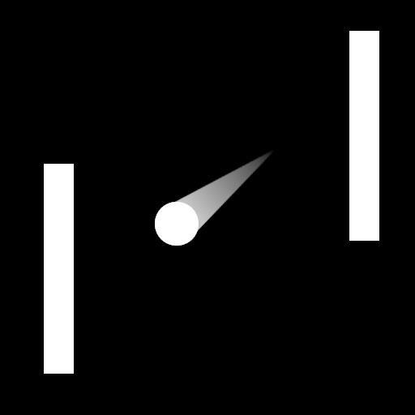

# Pong em Godot

Esse projeto foi praticamente copiado desse 
[aqui](https://github.com/godotengine/godot-demo-projects), pra eu explorar
Godot Engine e Gdscript. Esse reposiório também tem links para outros projetos
Pong implementados com outras linguages.

[README.md original](README-original.md)